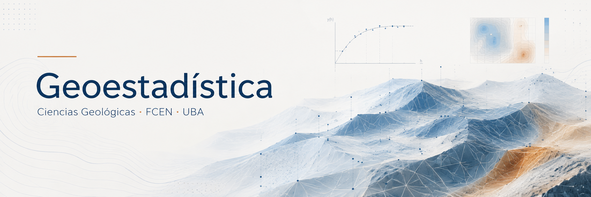

::: {.portada-manual}

{.portada-imagen fig-alt="Geoestadística - Ciencias Geológicas FCEN UBA"}

Manual de Geoestadística

Fundamentos teóricos y ejemplos geológicos

  

    AUTOR/A
    Docentes de Geoestadística
  

  

    FECHA DE PUBLICACIÓN
    14 de agosto de 2026
  

:::

# Propósito

Este manual desarrolla las ideas fundamentales de la geoestadística desde los primeros problemas de descripción de datos hasta la modelización de la dependencia espacial y la estimación por kriging.

La pregunta que organiza el recorrido es sencilla: **¿qué cambia cuando, además del valor observado, importa dónde fue observado?** Antes de responderla necesitamos comprender qué puede —y qué no puede— decir la estadística clásica sobre una muestra.

## Un caso conductor

A lo largo del texto volveremos sobre concentraciones de arsénico medidas en pozos de agua subterránea de la provincia de Buenos Aires. El caso permite avanzar por capas:

- describir una muestra de concentraciones;
- estudiar su distribución y sus valores extremos;
- comparar muestras y discutir representatividad;
- incorporar las coordenadas de cada pozo;
- reconocer continuidad, anisotropía y escalas espaciales;
- estimar en lugares no muestreados y cuantificar incertidumbre.

Los datos reales definitivos, su procedencia y sus condiciones de uso se documentarán antes de incorporarlos. Mientras tanto, el [laboratorio integrador](ejemplos/01-caso-sintetico.qmd) utiliza una población sintética reproducible de 1000 pozos para mantener un mismo caso entre capítulos sin atribuir valores a localizaciones reales.

## Reproducibilidad

Las figuras que representen resultados numéricos se generarán, siempre que sea posible, mediante código Python incluido junto al texto. Los bloques están pensados para ejecutarse en Jupyter o Google Colab utilizando bibliotecas de uso extendido. Cuando una ilustración requiera diseño manual o una fuente externa todavía no disponible, el texto mostrará un marcador explícito con su propósito y contenido esperado.

## Estado actual del manual

Esta versión cubre el tramo inicial de la materia: datos, muestreo, estadística descriptiva, probabilidad, distribución muestral, intervalos de confianza y pruebas de hipótesis. Los capítulos espaciales —variable regionalizada, variograma y kriging— se incorporarán progresivamente a medida que avancen las clases.

El texto debe leerse como un libro en construcción controlada: los capítulos publicados buscan ser autosuficientes y revisables; los temas aún no publicados no se reemplazan por apuntes incompletos.

## Alcance

El libro combina tres niveles de lectura:

- una narrativa conceptual, accesible sin seguir la clase;
- formulaciones matemáticas con supuestos explícitos;
- ejemplos reproducibles que conectan la teoría con problemas geológicos.

No pretende reemplazar las fuentes bibliográficas especializadas. Su función es construir un camino coherente hacia ellas y conservar la lógica didáctica de la materia a medida que evoluciona.

## Teoría y práctica

El orden de los temas sigue la cronología de la materia. Los ejemplos computacionales adoptan la filosofía de los libros prácticos reproducibles: código visible, datos accesibles o generados de manera transparente, semillas fijas y una interpretación junto a cada resultado. Esta decisión está inspirada, entre otros recursos educativos abiertos, por el enfoque de @pyrcz_2024, pero el desarrollo, los ejemplos y la secuencia de este manual son propios de la materia.
