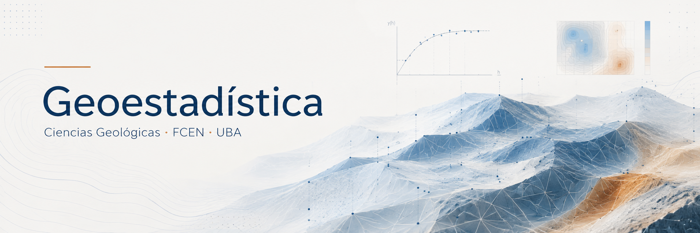

::: {.portada-manual}

{.portada-imagen fig-alt="Geoestadística - Ciencias Geológicas FCEN UBA"}

[Fundamentos teóricos y ejemplos geológicos]{.portada-titulo}

[Manual en construcción para la materia de Geoestadística]{.portada-subtitulo}

::: {.portada-metadata}

::: {.portada-item}
[DOCENTES]{.portada-label}

[Docentes de Geoestadística]{.portada-valor}
:::

::: {.portada-item}
[FECHA DE PUBLICACIÓN]{.portada-label}

[14 de agosto de 2026]{.portada-valor}
:::

:::

:::

# Propósito

Este manual desarrolla progresivamente las ideas fundamentales que conducen hacia la geoestadística: comienza con problemas de descripción de datos, muestreo, probabilidad e inferencia, y avanza hacia el estudio de relaciones entre variables y, más adelante, de la dependencia espacial.

La pregunta que organiza el recorrido es sencilla: **¿qué cambia cuando, además del valor observado, importa dónde fue observado?** Antes de responderla necesitamos comprender qué puede —y qué no puede— decir la estadística clásica sobre una muestra.

## Un caso conductor

A lo largo del texto volveremos sobre concentraciones de arsénico medidas en pozos de agua subterránea de la provincia de Buenos Aires. El caso permite avanzar por capas:

- describir una muestra de concentraciones;
- estudiar su distribución y sus valores extremos;
- comparar muestras y discutir representatividad;
- incorporar las coordenadas de cada pozo;
- preparar la transición hacia continuidad, anisotropía y escalas espaciales;
- discutir, en etapas posteriores, cómo estimar en lugares no muestreados y cuantificar incertidumbre.

Los datos reales definitivos, su procedencia y sus condiciones de uso se documentarán antes de incorporarlos. Mientras tanto, los ejemplos reproducibles utilizan una población sintética de 1000 pozos para mantener continuidad entre capítulos sin atribuir valores a localizaciones reales.

## Reproducibilidad

Las figuras que representen resultados numéricos se generarán, siempre que sea posible, mediante código Python incluido junto al texto. Los bloques están pensados para ejecutarse en Jupyter o Google Colab utilizando bibliotecas de uso extendido. Cuando una ilustración requiera diseño manual o una fuente externa todavía no disponible, el texto mostrará un marcador explícito con su propósito y contenido esperado.

## Estado actual del manual

Esta versión cubre el primer tramo conceptual del manual: datos y muestreo; estadística descriptiva; probabilidad; distribución muestral e intervalos de confianza; distribución $t$ de Student y pruebas de hipótesis; errores tipo I y II, potencia y tamaño de efecto; muestras apareadas; comparación de varianzas mediante la distribución $F$; análisis de frecuencias categóricas mediante $\chi^2$ de independencia; correlación; regresión lineal simple; y una síntesis integradora del recorrido desde el dato hasta la inferencia.

A lo largo de estos capítulos se refuerza una idea que será central en la segunda mitad de la materia: la inferencia clásica depende del diseño y de la cantidad de información efectivamente independiente. La pseudorreplicación y la dependencia espacial funcionan así como un puente hacia el núcleo específicamente geoestadístico.

Los capítulos espaciales se incorporarán progresivamente cuando formen parte del tramo publicado del manual. Hasta entonces, los capítulos visibles buscan ser autosuficientes y revisables; los temas aún no publicados no se reemplazan por apuntes incompletos.

## Alcance

El libro combina tres niveles de lectura:

- una narrativa conceptual, accesible sin seguir la clase;
- formulaciones matemáticas con supuestos explícitos;
- ejemplos reproducibles que conectan la teoría con problemas geológicos.

No pretende reemplazar las fuentes bibliográficas especializadas. Su función es construir un camino coherente hacia ellas y conservar la lógica didáctica de la materia a medida que evoluciona.

## Teoría y práctica

El orden de los temas sigue la cronología de la materia. Los ejemplos computacionales adoptan la filosofía de los libros prácticos reproducibles: código visible, datos accesibles o generados de manera transparente, semillas fijas y una interpretación junto a cada resultado. Esta decisión está inspirada, entre otros recursos educativos abiertos, por el enfoque de @pyrcz_2024, pero el desarrollo, los ejemplos y la secuencia de este manual son propios de la materia.
